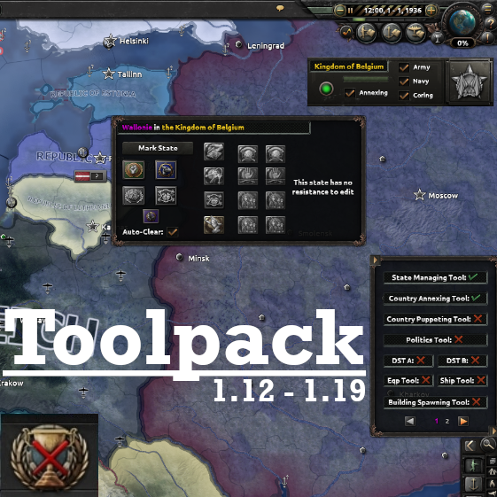

<div align="center">



# Toolpack for Magna Europa: Reforged


**English** | [简体中文](README_zh-CN.md)

**A minimal compatibility patch that makes [Toolpack without the Errors](https://steamcommunity.com/sharedfiles/filedetails/?id=2913150560) work under [Magna Europa: Reforged](https://steamcommunity.com/sharedfiles/filedetails/?id=3809580289).**

</div>

---

## What this is

[Magna Europa: Reforged](https://steamcommunity.com/sharedfiles/filedetails/?id=3809580289) declares `replace_path` on the entire script layer (`common/scripted_guis`, `common/decisions`, `events`, …) — every directory Toolpack writes into. Since Toolpack's descriptor only depends on the predecessor mod *Magna Europa: Reloaded*, nothing forces it to load after Reforged; when it loads first, **its whole script layer is silently discarded** and the mod appears to do nothing.

This submod re-ships Toolpack's script-layer files (41 files, byte-identical to the upstream 2026-08-10 revision except the remapped lines below) and declares dependencies on both parents, guaranteeing it loads last and the toolpack UI survives.

All interface, gfx, localisation and opinion-modifier files are **not** copied — they keep loading from the Toolpack mod itself, so a Toolpack subscription is required.

## Required mods

| Mod | Link |
|---|---|
| Magna Europa: Reforged | [Workshop 3809580289](https://steamcommunity.com/sharedfiles/filedetails/?id=3809580289) |
| Toolpack without the Errors | [Workshop 2913150560](https://steamcommunity.com/sharedfiles/filedetails/?id=2913150560) |
| **This patch** — enable alongside both; `dependencies` makes it load last | |

## What was changed for the ME map

Exactly **8 lines** in `common/scripted_guis/tpt.txt`: the faction-treaty flavour names (`tpt_create_faction_click`) test `owns_state` against vanilla capital-state IDs that mean different states on the ME map. They are remapped to the ME state holding the corresponding capital victory point:

| Vanilla state | Meaning | → ME state |
|---|---|---|
| 3 | Geneva | 1452 — Geneve |
| 16 | Paris | 571 — Paris |
| 126 | London | 2475 — London |
| 64 | Berlin | 1650 — East Berlin |
| 2 | Rome | 876 — Roma Centro |
| 219 | Moscow | 229 — Moscow |
| 4 | Vienna | 1817 — North Vienna |
| 10 | Warsaw | 508 — Warszawa |

Everything else was audited and needs no change — all other state/province access is scope-driven, no literal province IDs exist, and building/tech/ideology IDs all resolve on ME. See [PORTING.md](PORTING.md) for the full audit.

## Known limitations

- The cosmetic-tag tool (`cct`) silently does nothing for countries without `TAG_ideology` cosmetic tags — same as on vanilla.
- `improved`/`advanced_battlecruiser` hulls don't exist in ME's tech tree; those two spawn options no-op.
- Do **not** use the discontinued *Toolpack for Magna Europa* (Workshop 2973258716, 1.13-only repack).

## Updating after a Toolpack update

```bash
python tools/sync_toolpack.py <path-to-workshop-toolpack>
```

Re-copies the script layer from a fresh download and re-applies the 8-line remap; stale upstream-deleted files are removed automatically. Review with `git diff` afterwards.

## Version

`v0.1.0` — tracks Toolpack revision **2026-08-10**, Magna Europa: Reforged **0.99.7**, HoI4 **1.19.\***.
